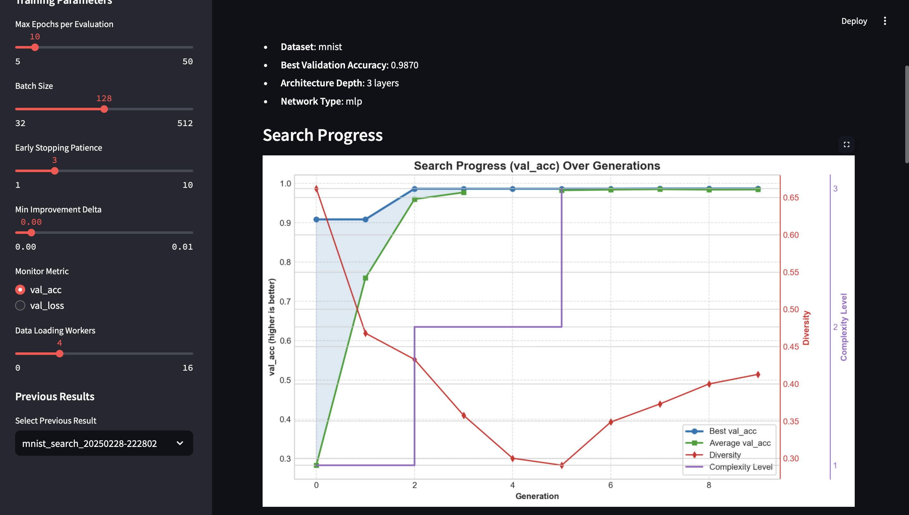

# S-NAS: Simple Neural Architecture Search

**⚠️ NOTE: This project is still a work in progress and may contain bugs. Use at your own risk. ⚠️**

S-NAS is a streamlined system that automates the discovery of optimal neural network architectures for specific datasets. Rather than manually designing neural networks, S-NAS efficiently explores different architecture configurations to find ones that perform best on predefined benchmark datasets.


## Features

- **Multiple Search Methods**:
  - **Evolutionary Search**: Uses genetic algorithms to efficiently explore the architecture space
  - **PNAS (Progressive Neural Architecture Search)**: Uses a surrogate model to predict architecture performance
  - **ENAS (Efficient Neural Architecture Search)**: Uses parameter sharing between models for faster evaluation
  - **PNAS+ENAS (Combined)**: A hybrid approach combining surrogate modeling with parameter sharing
- **Multiple Neural Network Types**: Supports CNNs, MLPs, ResNets, and MobileNets
- **Multiple Datasets**: Works with standard datasets:
  - [CIFAR-10 & CIFAR-100](https://www.cs.toronto.edu/~kriz/cifar.html) (32×32 RGB images)
  - [SVHN](http://ufldl.stanford.edu/housenumbers/) (Street View House Numbers, 32×32 RGB images)
  - [MNIST](http://yann.lecun.com/exdb/mnist/) (handwritten digits, 28×28 grayscale images)
  - [KMNIST](https://github.com/rois-codh/kmnist) (Japanese characters, 28×28 grayscale images)
  - [QMNIST](https://github.com/facebookresearch/qmnist) (extended MNIST, 28×28 grayscale images)
  - [EMNIST](https://www.nist.gov/itl/products-and-services/emnist-dataset) (extended MNIST with letters, 28×28 grayscale images)
  - [Fashion-MNIST](https://github.com/zalandoresearch/fashion-mnist) (fashion items, 28×28 grayscale images)
  - [STL-10](https://cs.stanford.edu/~acoates/stl10/) (higher resolution object images, 96×96 RGB images)
  - [DTD](https://www.robots.ox.ac.uk/~vgg/data/dtd/) (Describable Textures Dataset, 47 texture categories)
  - [GTSRB](https://benchmark.ini.rub.de/gtsrb_dataset.html) (German Traffic Sign Recognition Benchmark, 43 traffic sign classes)
- **Custom Dataset Support**:
  - CSV-based datasets with image paths and labels
  - Folder-based image datasets with class subfolders
- **Advanced Metrics**: Computes precision, recall, F1, confusion matrices, and ROC curves
- **Model Export**: Exports models to ONNX, TorchScript, quantized, and mobile formats
- **Checkpoint System**: Automatic state saving and recovery for long-running searches
- **Distributed Evaluation**: Distributes model training across multiple GPUs
- **Visualization**: Provides rich visualizations of search progress and architecture performance
- **Streamlit Interface**: User-friendly web interface for controlling the search process with real-time progress tracking and the ability to stop ongoing searches

## Installation

### Requirements

- Python 3.7+
- PyTorch 1.9+
- CUDA-compatible GPU (recommended)

### Setup

1. Clone the repository:

   ```bash
   git clone https://github.com/noface-0/S-NAS.git
   cd snas
   ```

2. Install dependencies:

   ```bash
   pip install -r requirements.txt
   ```

## Usage

### Streamlit Interface

The easiest way to use S-NAS is through the Streamlit interface:

```bash
streamlit run app.py
```

This will open a web interface where you can:

- Select a dataset (built-in or custom)
- Choose a search method (Evolutionary, PNAS, ENAS, or PNAS+ENAS)
- Configure search parameters
- Run the search process with real-time progress tracking
- Stop any search in progress while preserving intermediate results
- Resume from saved checkpoints
- Monitor search progress with dual progress bars (overall and current phase)
- Visualize results with interactive charts
- Export discovered architectures

### Command Line

You can also run S-NAS from the command line for batch processing:

```bash
python main.py --dataset cifar10 --population-size 20 --generations 10 --gpu-ids 0,1
```

Common options:

- `--dataset`: Dataset to use (`cifar10`, `mnist`, `fashion_mnist`)
- `--search-method`: Search method to use (`evolutionary`, `pnas`, `enas`, `pnas_enas`)
- `--network-type`: Network architecture type (`all`, `cnn`, `mlp`, `resnet`, `mobilenet`)
- `--population-size`: Population size for evolutionary search
- `--generations`: Number of generations/iterations to run
- `--gpu-ids`: Comma-separated list of GPU IDs to use
- `--output-dir`: Directory to save results
- `--evaluate`: Path to an architecture JSON file for evaluation only
- `--patience`: Early stopping patience (number of epochs without improvement)
- `--min-delta`: Minimum change to qualify as improvement for early stopping
- `--monitor`: Metric to monitor for early stopping ('val_acc' or 'val_loss')
- `--num-workers`: Number of worker threads for data loading
- `--checkpoint-frequency`: Save a checkpoint every N generations (0 to disable)
- `--resume-from`: Path to a checkpoint file to resume search from
- `--weight-sharing-max-models`: Maximum number of models in the weight sharing pool (default: 100)

#### PNAS-specific options:
- `--beam-size`: Number of top architectures to keep in the beam (default: 10)
- `--max-complexity`: Maximum complexity level to explore (default: 3)
- `--num-expansions`: Number of expansions per architecture in the beam (default: 5)

#### ENAS-specific options:
- `--controller-sample-count`: Number of architectures for the controller to sample (default: 50)
- `--controller-entropy-weight`: Entropy weight for exploration (default: 0.1)

## How It Works

S-NAS combines evolutionary algorithms with advanced optimization techniques for efficient neural architecture search:

### Search Methods

S-NAS offers several state-of-the-art neural architecture search methods, all of which support real-time progress tracking and the ability to interrupt searches while preserving results:

#### Evolutionary Search

The traditional evolutionary algorithm that uses genetic operations to explore the architecture space:
- Uses tournament selection, crossover, and mutation
- Gradually improves architectures through generations
- Balances exploration and exploitation through selection pressure

#### PNAS (Progressive Neural Architecture Search)

Based on the paper by Liu et al. (2018), PNAS uses a surrogate model to predict performance:
- Trains an LSTM-based surrogate model on evaluated architectures
- Uses the model to predict performance of new candidate architectures
- Focuses evaluation on the most promising candidates
- Progressively increases architecture complexity
- Provides detailed progress tracking for each search phase (initial evaluation, model training, prediction)

#### ENAS (Efficient Neural Architecture Search)

Based on the paper by Pham et al. (2018), ENAS uses parameter sharing for efficiency:
- Maintains a shared pool of weights for similar architectures
- Uses a controller (RNN) to sample architectures
- Trains the controller with reinforcement learning
- Significantly speeds up the search process

#### PNAS+ENAS Combined

A hybrid approach that combines the strengths of both PNAS and ENAS:
- Uses surrogate model from PNAS for prediction
- Leverages parameter sharing from ENAS for efficiency
- Balances between prediction-based and shared-weights-based evaluations using a configurable importance weight
- Allows fine-tuning the balance between surrogate model predictions and shared weights evaluations
- Offers the most efficient search while maintaining high quality

### Core Search Process

The general search process follows these steps:

1. **Initialization**:
   - Creates a population of random architecture configurations
   - Each architecture is defined by parameters like network type, layers, filters, activations, etc.
   - Initial architectures follow a progressive complexity approach (starting simpler)

2. **Evaluation**:
   - Trains and evaluates each architecture on the target dataset
   - Uses parameter sharing to avoid training from scratch when possible
   - Records performance metrics (validation accuracy, loss) as fitness scores
   - Caches results to avoid re-evaluating identical architectures

3. **Selection**:
   - Uses tournament selection to choose parent architectures
   - Better-performing architectures have higher chances of being selected
   - Elite preservation keeps the best architectures unchanged across generations

4. **Evolution**:
   - Creates new architectures through crossover (combining parts of parent architectures)
   - Applies controlled random mutations to introduce diversity
   - Mutation rates are adjustable and target different aspects of the architecture
   - Progressive complexity constraints ensure appropriate architecture scale

5. **Iteration**:
   - Repeats the process for multiple generations
   - Complexity gradually increases as search progresses
   - Weight sharing becomes more effective as the pool of trained models grows
   - Population diversity is monitored to prevent premature convergence
   - Progress is tracked and displayed in real-time through dual progress bars

6. **Search Control**:
   - Searches can be interrupted at any time while preserving results found so far
   - Checkpoints are saved periodically for long-running searches
   - Search state can be resumed from previously saved checkpoints

7. **Export**:
   - Returns the best-discovered architecture after all generations
   - Can export to multiple model formats (ONNX, TorchScript, etc.)

### Parameter Sharing (ENAS)

Parameter sharing significantly speeds up evaluation:

- Maintains pools of trained weights for each network type
- When evaluating a new architecture:
  1. Calculates similarity scores with previously trained architectures
  2. Selects the most compatible weights based on architectural similarity and performance
  3. Transfers weights where layer shapes match
  4. Initializes random weights only for incompatible layers
  5. Rebuilds optimizer state for the combined model
- Prioritizes high-performing models in the sharing pool
- Separate pools are maintained for different network types (CNN, MLP, etc.)

### Progressive Search (PNAS)

Progressive complexity growth makes exploration more efficient:

- Defines three complexity levels for architectures:
  - **Level 1**: 2-3 layers, basic network types (CNN, MLP), simple components
  - **Level 2**: 3-5 layers, more network types (ResNet, Enhanced MLP), moderate complexity
  - **Level 3**: Full architecture space with all network types and components

- Search proceeds through these phases:
  1. Early generations focus on finding good basic architectures
  2. Middle generations refine and expand promising structures
  3. Later generations explore the full architecture space
  
- For each complexity level, constraints are placed on:
  - Number of layers
  - Network types allowed
  - Layer configurations (filters, kernel sizes, etc.)
  - Advanced features (skip connections, normalization, etc.)

#### Detailed Complexity Level Explanation

Complexity levels control how architectures evolve during search, gradually expanding from simple to more sophisticated:

**Level 1 (Simple)**
- Restricts architectures to a maximum of 3 layers
- Limits network types to basic CNNs and MLPs
- Restricts filter counts to smaller values (≤ 128)
- Disables skip connections and batch normalization
- Uses only ReLU activations
- Creates a focused search space of simple architectures that train quickly

**Level 2 (Moderate)**
- Allows up to 5 layers
- Expands network types to include ResNet, MobileNet, and Enhanced MLP
- Permits moderate filter counts (up to 256)
- Allows batch normalization and some skip connections
- Supports various activation functions (ReLU, Leaky ReLU, ELU)
- Builds on promising architectures from Level 1 by adding complexity

**Level 3 (Complex)**
- Allows full range of layers (up to the maximum defined in the search)
- Includes all network types (including DenseNet, ShuffleNetV2, EfficientNet)
- Supports maximum filter counts (up to 512)
- Enables all advanced features (skip connections, residual blocks, etc.)
- Allows all activation functions and normalization techniques
- Fine-tunes the most promising architectures with sophisticated components

The search transitions between these levels automatically based on progress and can be visualized in real-time through the UI. Here's how to configure complexity in different search methods:

**In the UI:**
- For **PNAS Search**: Set the "Maximum Complexity Level" slider (1-3) in the search parameters
- For **Evolutionary Search**: Enable/disable progressive search using the checkbox
- For **PNAS+ENAS Combined**: Controls both the maximum complexity and the transition schedule

**Via Command Line:**
- For PNAS: `--max-complexity 2` (default) to set maximum complexity level
- For Evolutionary: `--enable-progressive true` to enable progressive complexity
- For Combined: `--max-complexity 3 --enable-progressive true`

The progress bars in the UI will show which complexity level the search is currently exploring, and transitions are visible in the search visualization.

 **Note on Progressive Search and MLP Bias**

  When using progressive search with datasets like MNIST, you may notice a bias toward MLP architectures in the search results. This occurs because:

  1. Progressive search starts with simpler architectures and gradually increases complexity
  2. For grayscale, low-resolution datasets like MNIST, MLPs can achieve good accuracy early in the search
  3. Once MLPs dominate the early population, evolutionary pressure tends to maintain this architecture type

  If you want to explore a wider variety of architectures (especially CNNs) on simpler datasets, consider:
  - Disabling progressive search with --enable-progressive=False
  - Explicitly selecting a network type with --network-type cnn
  - Running more generations to allow the search to explore more complex architectures

  For complex image datasets like CIFAR-10, this bias is less pronounced as CNNs have a natural advantage over MLPs.

  ---

### Exploration Strategies

To ensure thorough search space coverage:

- **Mutation Mechanism**: The mutation system applies stochastic changes to architecture parameters:
  - Each parameter has an independent chance (controlled by mutation_rate) of being modified
  - Network type has a lower mutation probability (0.2 × mutation_rate) to prevent disruptive changes
  - Layer-specific parameters can be added/removed when layer count changes
  - Numeric parameters are perturbed within their allowed ranges
  - Categorical parameters (activations, etc.) randomly select from available options
  - All mutations respect architectural constraints to ensure validity
- **Diversity Tracking**: The system quantifies population diversity at each generation:
  - Calculates [Shannon entropy](https://www.sciencedirect.com/topics/engineering/shannon-entropy) across all architecture parameters
  - Monitors distribution of parameter values in the population
  - Tracks diversity metrics over time to detect convergence
  - Logs diversity scores that can be visualized to understand search dynamics
  - Higher scores indicate more diverse exploration of the search space
- **Tournament Selection**: Uses competitive selection to balance exploration and exploitation:
  - Randomly samples a small subset (tournament_size) of architectures
  - Selects the best performer from each tournament as a parent
  - Smaller tournament sizes maintain diversity but slow convergence
  - Larger tournament sizes increase selection pressure toward top performers
  - Creates a probabilistic process where better architectures are more likely to reproduce

- **Fast Mode**: Accelerates early exploration phases:
  - Reduces the number of training epochs for evaluations
  - Limits the number of batches processed during early generations
  - Enables broader exploration of the architecture space
  - Full evaluation is applied to the final best architecture

- **Crossover Strategy**: Intelligently combines parent architectures to create offspring:
  - For compatible parents (same network type), performs parameter-wise crossover
  - For incompatible parents (different network types), applies mutation to one parent
  - Uses single-point crossover for layer-specific parameters (filters, activations, etc.)
  - Randomly selects parameters from either parent for global settings
  - Ensures architectural consistency after recombination
  - Probabilistically chooses between crossover and mutation-only reproduction

### Performance Optimizations

Additional optimizations include:

- **Caching**: Identical architectures are evaluated only once
- **Early Stopping**: Training uses patience-based stopping to avoid wasting computation
- **GPU Parallelization**: Multiple architectures can be evaluated in parallel across GPUs
- **Checkpoint System**: Search state can be saved and resumed at any point
- **Progress Tracking**: Dual progress bars (overall progress and current phase progress) provide detailed feedback
- **Interruptible Search**: Any search can be stopped at any time, preserving results found so far

## Custom Datasets

S-NAS supports using your own datasets in two formats:

### CSV-based Datasets

You can use a CSV file with columns for image paths and labels:

```bash
python main.py --custom-csv-dataset data/my_dataset.csv --custom-dataset-name my_dataset --image-size 64x64
```

The CSV file should have at least two columns:

- An image column (default: 'image') with relative or absolute image paths
- A label column (default: 'label') with class labels

### Folder-based Datasets

You can also use a folder structure with class subfolders:

```bash
python main.py --custom-folder-dataset data/images --custom-dataset-name my_images --image-size 224x224
```

The folder should have this structure:

```
data/images/
├── class1/
│   ├── image1.jpg
│   ├── image2.jpg
│   └── ...
├── class2/
│   ├── image1.jpg
│   ├── image2.jpg
│   └── ...
└── ...
```

## Model Export

S-NAS can export discovered architectures in various formats for deployment:

### TorchScript Export

```bash
python main.py --dataset cifar10 --export-model --export-format torchscript
```

### ONNX Export

```bash
python main.py --dataset mnist --export-model --export-format onnx
```

### Quantized Model Export

```bash
python main.py --dataset fashion_mnist --export-model --export-format quantized
```

### Mobile-Optimized Export

```bash
python main.py --dataset cifar100 --export-model --export-format mobile
```

### All Formats

```bash
python main.py --dataset cifar10 --export-model --export-format all
```

Each exported model comes with an example Python script showing how to use it.

## Project Structure

- `snas/`: Main package
  - `architecture/`: Architecture space and model builder
  - `data/`: Dataset registry
  - `search/`: Search algorithms and evaluation
    - `evolutionary_search.py`: Evolutionary search algorithm
    - `evaluator.py`: Architecture evaluation component
    - `pnas/`: Progressive Neural Architecture Search implementation
    - `enas_search.py`: Efficient Neural Architecture Search implementation
  - `utils/`: Utility modules
    - `job_distributor.py`: Parallel evaluation across multiple GPUs
    - `exceptions.py`: Custom exception classes for structured error handling
    - `state_manager.py`: Checkpoint system for saving and resuming searches
  - `visualization/`: Visualization utilities
- `app.py`: Streamlit application
- `main.py`: Command-line interface
- `examples/`: Example scripts
  - `example_search.py`: Example of evolutionary search
  - `example_pnas_search.py`: Example of Progressive NAS
  - `example_evaluate.py`: Example of evaluating architectures

## Architecture Space

S-NAS explores architectures with the following parameters and neural network types:

### Network Types

- **CNN**: Standard convolutional neural networks
- **MLP**: Multi-layer perceptrons (fully-connected networks)
- **Enhanced MLP**: MLP with residual connections and layer normalization
- **ResNet**: Residual networks with skip connections
- **MobileNet**: Networks with depthwise separable convolutions
- **DenseNet**: Networks with dense connectivity pattern
- **ShuffleNetV2**: Networks with channel split and shuffle operations
- **EfficientNet**: Scalable networks with mobile inverted bottleneck convolutions

### Parameters

#### Shared Parameters
- Number of layers: 2-50 (for ResNet, each "layer" is a residual block containing 2-3 actual layers)
- Batch normalization: Yes/No
- Dropout rate: 0.0, 0.1, 0.2, 0.3, 0.5
- Learning rate: 0.1, 0.01, 0.001, 0.0001
- Optimizer: SGD, Adam, AdamW

#### CNN/ResNet/MobileNet Parameters
- Filters per layer: 16, 32, 64, 128, 256
- Kernel sizes: 3, 5, 7
- Activations: ReLU, Leaky ReLU, ELU, SELU
- Skip connections: Yes/No

#### MLP Parameters
- Hidden units per layer: 64, 128, 256, 512, 1024
- Activations: ReLU, Leaky ReLU, ELU, SELU

#### Enhanced MLP Parameters
- Hidden units per layer: 64, 128, 256, 512, 1024
- Activations: ReLU, Leaky ReLU, ELU, SELU, GELU
- Layer normalization: Yes/No
- Residual connections: Yes/No

#### MobileNet Parameters
- Width multiplier: 0.5, 0.75, 1.0, 1.25

#### DenseNet Parameters
- Growth rate: 12, 24, 32, 48
- Block configuration: Various arrangements of layers per block
- Compression factor: 0.5, 0.7, 0.8
- Bottleneck size: 2, 4

#### ShuffleNetV2 Parameters
- Width multiplier: 0.5, 0.75, 1.0, 1.25, 1.5
- Channel configurations: Different for each scale
- Blocks per stage: Various configurations

#### EfficientNet Parameters
- Width factor: 0.5, 0.75, 1.0, 1.25, 1.5
- Depth factor: 0.8, 1.0, 1.2, 1.4
- Squeeze-and-excitation ratio: 0.0, 0.125, 0.25

This space can be customized in `architecture_space.py`.

## Examples

### Running a Search

```python
# Example script to run a search on CIFAR-10
python examples/example_search.py
```

### With Checkpointing

```python
# Run search with checkpoints every 2 generations
python examples/example_search.py --checkpoint-frequency 2
```

### Resuming a Search

```python
# Resume from a previous checkpoint
python examples/example_search.py --resume-from output/results/cifar10_checkpoint_gen5_20250226-123456.pkl
```

### Running Different Search Methods

```python
# Evolutionary Search (default)
python examples/example_search.py

# PNAS Search
python examples/example_pnas_search.py

# ENAS Search
# For command-line, use main.py which supports all search methods
python main.py --dataset cifar10 --search-method enas

# PNAS+ENAS Combined
python examples/example_pnas_search.py --use-shared-weights --shared-weights-importance 0.5
```

### Evaluating an Architecture

```python
# Evaluate a discovered architecture on MNIST
python examples/example_evaluate.py --architecture output/best_architecture.json --dataset mnist
```

## Results Visualization

S-NAS provides several visualization options:

- **Search Progress**: Shows best and average fitness over generations
- **Network Graph**: Visual representation of the network structure
- **Training Curves**: Training and validation loss/accuracy curves
- **Parameter Importance**: Analysis of which parameters contribute most to performance




## Exporting Models

After discovering a good architecture, you can export it as a standalone PyTorch model:

```python
python examples/example_evaluate.py --architecture output/best_architecture.json --dataset cifar10 --export-model
```

This will generate a Python file containing a self-contained PyTorch model that you can use in your own projects.


## Performance Features

S-NAS incorporates several performance optimizations by default:

- **Parameter Sharing (ENAS)**: Weight sharing between models for much faster search (Pham et al., 2018)
- **Progressive Search**: Gradual complexity increase for more efficient exploration (Liu et al., 2018)
- **PNAS+ENAS Hybrid**: Combines surrogate model predictions with shared weights using a configurable importance weight
- **Dynamic Weight Adjustment**: Automatically tunes the balance between surrogate model and shared weights
- **Performance Tracking**: Detailed timing and resource usage statistics including precise GPU time measurement
- **Surrogate Accuracy Analysis**: Evaluates and visualizes surrogate model prediction quality
- **Fast Mode**: Early generations use a reduced training protocol for faster exploration
- **Gradient Clipping**: Automatic gradient clipping prevents numerical instability issues

Additional performance tips:

- **GPU Parallelization**: Use multiple GPUs to evaluate architectures in parallel
- **Population Size**: Larger populations explore more architectures but take longer
- **Generations**: More generations allow for finer optimization but take longer
- **Early Stopping**: Configure patience and monitoring metric to optimize training time
- **Data Loading**: Adjust num_workers based on your CPU capabilities for faster data loading
- **Batch Size**: Larger batch sizes can speed up training on powerful GPUs
- **Checkpointing**: Use `--checkpoint-frequency` to save progress periodically during long runs
- **Resume Capability**: If a run is interrupted, use `--resume-from` to continue from a checkpoint
- **Progress Tracking**: All search methods provide detailed progress information through dual progress bars
- **Interruptible Search**: Any search can be stopped safely while preserving results found so far

### Advanced Search Techniques

S-NAS incorporates simplified versions of two key efficiency technologies from recent research papers by default. These implementations capture the core concepts while being more practical to implement:

#### Parameter Sharing (ENAS)

Parameter sharing based on the ENAS paper by Pham et al. (2018) significantly speeds up architecture search by reusing weights between similar architectures:

1. When a new model is created, it automatically reuses weights from previously trained models of the same type
2. Weights are transferred where layer shapes match, with new random weights used for incompatible layers
3. The best-performing model weights are prioritized for sharing
4. The system maintains separate weight pools for different network types (CNN, MLP, etc.)

Parameter sharing typically provides a 2-5x speedup for the search process, while maintaining comparable accuracy in discovering effective architectures.

#### Progressive Search

Progressive neural architecture search based on the paper by Liu et al. (2018) makes the search more efficient by gradually increasing architecture complexity:

1. The search begins with simple architectures (fewer layers, basic components)
2. As search progresses, complexity gradually increases in predefined levels
3. Early generations focus on finding good basic structures with fewer parameters
4. Later generations refine those structures with more advanced components

This leads to:
- More efficient exploration of the architecture space
- Better architectures found with the same computational budget
- Reduced chance of getting stuck in local optima

S-NAS combines both these techniques by default, providing state-of-the-art efficiency for neural architecture search.

#### Optimizing Complexity Levels For Your Task

The complexity level settings can significantly impact search efficiency and results:

- **For simple datasets** (MNIST, Fashion-MNIST):
  - Consider setting a lower maximum complexity (1-2)
  - Set a longer duration at Level 1 to thoroughly explore simpler architectures
  - If you want CNNs, consider disabling progressive search to avoid MLP bias

- **For medium datasets** (CIFAR-10, SVHN):
  - Use the default maximum complexity (2)
  - Balance time spent at each level
  - Consider using PNAS+ENAS combined for best efficiency

- **For complex datasets** (CIFAR-100, ImageNet):
  - Set maximum complexity to 3
  - Allow sufficient iterations at each level
  - Use parameter sharing to manage training time

- **For custom datasets**:
  - Start with a lower complexity (1-2) and monitor results
  - If models are underfitting, gradually increase complexity
  - Pay attention to the best-performing architecture type at each complexity level

The complexity mechanism works hand-in-hand with the progress tracking and stop functionality, allowing you to interrupt the search if you observe diminishing returns at higher complexity levels.

## Contributing

Contributions are welcome! Please feel free to submit a Pull Request.

## TODO List

1. **Add zero-shot entropy metric**
   - Implement entropy calculation based on Zen-NAS paper
   - Create pre-screening function to evaluate architectures without training
   - Set appropriate thresholds for filtering architectures

2. **Optimize evaluation pipeline**
   - Add pre-screening step before full training evaluation
   - Implement early termination for poor-performing models
   - Create fast evaluation mode with reduced epochs

3. **Improve error reporting**
   - Add detailed error messages in evaluation functions
   - Implement structured logging for architecture failures
   - Create error visualization in web interface

4. **Implement efficient architecture comparison**
   - Replace JSON serialization with hash-based tracking
   - Add fast structure similarity calculation
   - Create architecture fingerprinting function

5. **Add support for Vision Transformers**
   - Implement ViT model in model_builder.py
   - Add transformer-specific parameters to architecture space
   - Create appropriate mutation operators for attention mechanisms

6. **Add support for MLP-Mixer architectures**
   - Implement MLP-Mixer model structure
   - Add token/channel mixing parameters to architecture space
   - Create specialized evaluation metrics for MLP-Mixer performance

7. **Add Automated Tests**
   - Implement unit tests for core components
   - Add integration tests for search process
   - Set up CI pipeline for automated testing

8. **Optimize UI Responsiveness**
   - Further improve progress tracking during long operations
   - Add more granular progress reporting for complex search phases
   - Enhance real-time visualization during search

9. **Add search space visualization**
   - Create interactive visualization of the architecture space
   - Implement heatmaps showing explored vs unexplored regions
   - Add visualization of architectural similarity between models


## License

This project is licensed under the MIT License - see the LICENSE file for details.

## References

1. [Efficient Neural Architecture Search via Parameter Sharing](https://arxiv.org/abs/1802.03268)

2. [Neural Architecture Search with Reinforcement Learning](https://arxiv.org/abs/1611.01578)

3. [Progressive Neural Architecture Search](https://arxiv.org/abs/1712.00559)

4. [Learning Transferable Architectures for Scalable Image Recognition](https://arxiv.org/abs/1707.07012)